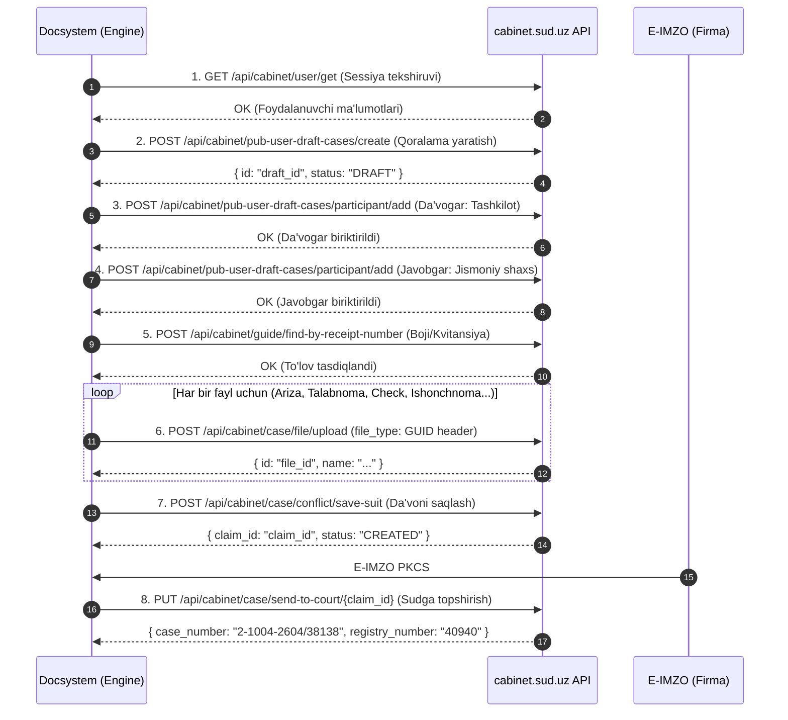

# cabinet.sud.uz (Adolat e-Sud) API Kiritish Skeleti (Submission Engine)

> Ushbu papka asosiy loyihaning boshqa qismlariga daxl qilmagan holda **to'liq alohida (isolated)** yaratildi.  
> Bu yerda `cabinet.sud.uz` portaliga da'vo arizalarini to'liq avtomatlashtirilgan holda **API orqali kiritib yuborish (E-filing Submission)** skeleti, barcha rasmiy bosqichlari (steps), endpointlari va payloadlari keltirilgan.

---

## 1. Jarayonning 8 ta Asosiy Bosqichi (Step-by-Step Workflow)

Portalga ariza kiritish qat'iy ketma-ketlikdagi 8 ta bosqichdan iborat:



---

## 2. Bosqichlar Detali va API So'rovlari

### Step 1: Sessiya va Token Tekshiruvi
Barcha so'rovlar portalga `X-AUTH-TOKEN` sarlavhasi orqali yuboriladi:
```http
GET https://cabinetapi.sud.uz/api/cabinet/user/get HTTP/1.1
X-AUTH-TOKEN: <ONEID_SESSION_TOKEN>
Accept: application/json
```

---

### Step 2: Qoralama (Draft Case) Yaratish
Sudda yangi elektron ish kartochkasi ochiladi.
- **Endpoint:** `POST /api/cabinet/pub-user-draft-cases/create`
- **Payload:**
```json
{
  "instance": "FIRST",
  "claim_type": "CIVIL",
  "claim_kind": "DECREE",
  "court_id": "f494f85e-b130-433d-ba9c-4afb3620f431",
  "categories": [
    "844ba777-f7fa-4a86-a347-8d333d28872d"
  ]
}
```
*Izoh:*
- `instance: "FIRST"` — Birinchi instansiya sudi.
- `claim_type: "CIVIL"` — Fuqarolik ishlari.
- `claim_kind: "DECREE"` — Sud buyrug'i (yoki `"SUIT"` — da'vo arizasi).
- `court_id` — Tumanlararo sudining rasmiy GUID kodi (masalan Uchtepa).
- `categories` — `844ba777-f7fa-4a86-a347-8d333d28872d` (*"Ёзма битимга асосланган ва қарздор томонидан тан олинган талаб"*).

---

### Step 3: Da'vogar (Claimant / Tashkilot) Qo'shish
Mikromoliya tashkilotining rekvizitlari kiritiladi.
- **Endpoint:** `POST /api/cabinet/pub-user-draft-cases/participant/add`
- **Payload:**
```json
{
  "draft_id": "<DRAFT_ID>",
  "type": "CLAIMANT",
  "is_main": true,
  "entity_type": "ORGANIZATION",
  "entity": {
    "tin": 311976765,
    "pinfl": null,
    "not_citizen": false
  },
  "entity_details": {
    "name": "\"BRIGHT FUTURE FINANCING MIKROMOLIYA TASHKILOTI\" MAS'ULIYATI CHEKLANGAN JAMIYAT MIKROMOLIYA TASHKILOTI",
    "short_name": "\"BRIGHT FUTURE FINANCING MIKROMOLIYA TASHKILOTI\" MCHJ MMT",
    "tin": "311976765",
    "director": "BOYNAZAROV AKRAM ANVAROVICH",
    "address": "Guruchariq MFY, Sag‘bon ko'chasi, 30 berk ko'chasi, 7/1-uy",
    "bank_account": "20216000207212842001",
    "bank_id": "e8a59e5d-4569-4a1a-97a2-f98359e6f5f1",
    "phone": "998993058435",
    "org_type": "LOCAL_ORG"
  }
}
```

---

### Step 4: Javobgar (Defendant / Qarzdor Shaxs) Qo'shish
Qarzdor fuqaroning shaxsiy ma'lumotlari.
- **Endpoint:** `POST /api/cabinet/pub-user-draft-cases/participant/add`
- **Payload:**
```json
{
  "draft_id": "<DRAFT_ID>",
  "type": "DEFENDANT",
  "is_main": true,
  "entity_type": "PERSON",
  "entity": {
    "pinfl": 33007962530011,
    "tin": null,
    "not_citizen": false
  },
  "entity_details": {
    "pinfl": "33007962530011",
    "first_name": "DANTES",
    "last_name": "AKRAMOV",
    "middle_name": "OTABEK O‘G‘LI",
    "passport_serial": "AE",
    "passport_number": "6149348",
    "birth_date": "1996-07-30T00:00:00",
    "address": "ИБН СИНО МФЙ, ИБН СИНО МФЙ, ИБН СИНО, uy:Р/С",
    "citizenship": "UZB_CITIZEN",
    "gender": "MALE"
  }
}
```

---

### Step 5: Davlat Boji va Kvitansiya Bog'lash
Billingdan olingan 262... raqamli 20,600 so'mlik to'lov kvitansiyasini portal bazasidan tekshirib, ishga biriktirish.
- **Endpoint:** `POST /api/cabinet/guide/find-by-receipt-number`
- **Payload:**
```json
{
  "receipt_number": "262196086404"
}
```

---

### Step 6: Fayllarni Majburiy `file_type` GUID Bilan Yuklash
Portal har bir hujjat turini o'zining ichki GUID kodi orqali taniydi. Fayl `multipart/form-data` ko'rinishida yuklanadi, `file_type` sarlavhasida GUID ko'rsatiladi:

- **Endpoint:** `POST /api/cabinet/case/file/upload`
- **Headers:**
  - `X-AUTH-TOKEN: <TOKEN>`
  - `file_type: <DOC_TYPE_GUID>`
- **Body:** `file = binary/pdf`

#### Rasmiy Slot GUID'lari (`constants.ts`):
| Hujjat Turi | `file_type` GUID | Vazifasi |
|---|---|---|
| **Ariza (Sud buyrug'i)** | `2554784d-b231-4dc9-aadf-819429cfeb70` | Palata muhrlagan rasmiy ariza |
| **Talabnoma** | `eb37ed47-d973-40bd-a9cd-a481add9c1ce` | Qarzni to'lash talabnomasi xati |
| **UZPOST Cheki** | `f264d870-a254-46b6-95cf-525d9e6a6299` | Pochta kvitansiyasi (yuborilganlik isboti) |
| **Ishonchnoma** | `e55124df-d369-4132-9cd0-635c81ccce3c` | Palata vakilining ishonchnomasi |
| **Guvohnoma** | `85f9394d-fe3b-4511-a437-3ff7434a48f8` | Firma davlat guvohnomasi |
| **Shartnoma / Oferta** | `616ccb56-4b2f-42ed-8522-7b351d2edb5f` | Elektron oferta va shartnomalar |

---

### Step 7: Da'vo Ishini Shakllantirish va Saqlash (Save Suit)
Barcha qismlar (qarz summalari, kvitansiya va yuklangan fayllar) bitta da'voga birlashtiriladi.
- **Endpoint:** `POST /api/cabinet/case/conflict/save-suit`
- **Payload:**
```json
{
  "draft_id": "<DRAFT_ID>",
  "court_id": "f494f85e-b130-433d-ba9c-4afb3620f431",
  "category_id": "844ba777-f7fa-4a86-a347-8d333d28872d",
  "claim_type": "CIVIL",
  "claim_kind": "DECREE",
  "amount_principal": 5000000.00,
  "amount_interest": 850000.00,
  "amount_penalty": 150000.00,
  "amount_total": 6000000.00,
  "receipt_number": "262196086404",
  "uploaded_file_ids": [
    "f1111111-2222-3333-4444-555555555555",
    "f6666666-7777-8888-9999-000000000000"
  ],
  "claim_statement": "Qarzdor AKRAMOV DANTES OTABEK O'G'LI dan 6 000 000 so'm qarzni undirish to'g'risida sud buyrug'i berishingizni so'raymiz."
}
```

---

### Step 8: E-IMZO Bilan Yakuniy Sudga Yuborish (Send to Court)
Da'vo sudyaga rasman taqdim etiladi.
- **Endpoint:** `PUT /api/cabinet/case/send-to-court/{claim_id}`
- **Payload:**
```json
{
  "signature": "<PKCS7_BASE64_SIGNATURE>"
}
```
- **Muvaffaqiyatli javob:**
```json
{
  "case_number": "2-1004-2604/38138",
  "registry_number": "40940",
  "current_status": "PENDING",
  "message": "Ариза судга муваффақиятли топширилди"
}
```

---

## 3. Ushbu Skeletdagi Fayllar Tarkibi

1. `constants.ts` — Portalning barcha rasmiy GUID'lari, endpointlari, hujjat turlari va toifalari.
2. `types.ts` — 8 ta qadam uchun barcha so'rov va javob modellari (TypeScript interfaces).
3. `client.ts` — `CabinetApiClient` HTTP mijozi (`X-AUTH-TOKEN`, timeouts, error-handling).
4. `uploader.ts` — `CabinetFileUploader` fayllarni to'g'ri `file_type` GUID bilan yuklovchi modul.
5. `builder.ts` — Ichki case ma'lumotlarini portal JSON formatiga o'tkazuvchi adapter.
6. `submitter.ts` — 8 ta qadamni to'liq ketma-ket bajaruvchi markaziy `CabinetSubmitEngine`.
7. `dry-run.ts` — Portal bilan xavfsiz sinov (dry-run probe) skripti.

---

## 4. Asosiy Loyiha Bilan Aloqasi
Ushbu papka **alohida modul** sifatida yaratilgan. Asosiy kod bazasiga hech qanday o'zgartirish kiritilmadi. Tizim to'liq tayyor bo'lganda, uni xohlagan vaqtda asosiy konveyerga (`prepare-ready` yoki worker) ulab ishlatish mumkin.
