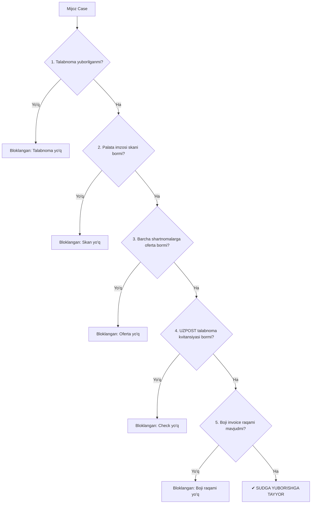

# Docsystem — Sudga Kiritib Yuborish Tizimi (Court Submission Engine)

> **Hujjat maqomi:** To'liq texnik va operatsion spetsifikatsiya  
> **Versiya:** 2.0 (Stabil)  
> **Sana:** 2026-09-05  
> **Mavzu:** Mikromoliya firmalari (Bright, Urban, Community) qarzlarini sud orqali undirish, ariza va ilovalarni yig'ish, kvotalash, E-IMZO bilan himoyalangan eksport, cabinet.sud.uz monitoringi va qaytgan ishlarni qayta ishlash.

---

## 1. Umumiy Arxitektura va Tizim Konteksti

`Docsystem` dasturida qarzdorlikni undirish konveyerining eng mas'uliyatli va markaziy bosqichlaridan biri — **«Sudga kiritib yuborish»** (`COURT_SUBMITTED`) jarayonidir. 

Konveyer quyidagi ketma-ketlikda ishlaydi:
```
Excel Import ──► Talabnoma (Hippo) ──► Ariza generatsiya ──► Sanoat palatasi (Chop/Imzo)
                                                                       │
                                                                       ▼
Sud monitoring ◄── Sudga yuborish ◄── Davlat boji (Billing) ◄── Palata skan-split
```

Tizimda sudga yuborish mexanizmi quyidagi asosiy prinsiplarga tayanadi:
1. **Hech qachon chala hujjat sudga ketmaydi:** Har bir mijoz (case) uchun 5 ta qat'iy shart (gate) va firma darajasidagi 3 ta hujjat mavjudligi dasturiy tekshiriladi.
2. **Kunlik sud kvotasi va ish vaqti qat'iy nazoratda:** Toshkent vaqti bo'yicha sudlarning qabul qilish vaqti (cutoff) va kunlik limitlari oshib ketmasligi uchun avtomatik taqsimlash dvigateli ishlaydi.
3. **E-IMZO xavfsizlik darvozasi:** Yuborishdan oldin yuridik shaxs (firma STIR) kaliti bilan tasdiqlanadi. Noto'g'ri kalit, jismoniy shaxs kaliti yoki boshqa firmaning kaliti server tomonidan bloklanadi.
4. **Orqaga qaytarish (Reversible):** Operator xato qilsa yoki sinov tariqasida yuborsa, bitta tugma bilan holat bekor qilinadi, sud kvotasi zaxiraga qaytariladi.
5. **Davlat portali bilan to'liq integratsiya:** `cabinet.sud.uz` (Adolat) va `billing.sud.uz` bilan jonli ma'lumot almashish, ajrimlarni o'qish va statuslarni yangilash.

---

## 2. Sudga Yuborishning 5 ta Qat'iy Sharti (Case-Level Gate)

Har bir mijoz (`ArizaCase`) sudga yuboriladiganlar ro'yxatiga (`sendable`) kirishi uchun **quyidagi 5 ta shart bir vaqtda bajarilgan bo'lishi shart**:

$$\text{Ready} = \text{Talabnoma} \land \text{Skan} \land \text{Oferta} \land \text{Check} \land \text{Boji}$$



### 1) Talabnoma yuborilganligi (`talabnomaAt != null`)
- Mijozga `xat.hippo.uz` yoki qo'lda reyestr orqali rasmiy talabnoma chiqarilgan va jo'natilgan bo'lishi kerak.
- Agar talabnoma yuborilmagan bo'lsa, sud arizani qabul qilmaydi (sudgacha nizoni hal qilish tartibi buzilgan deb qaytaradi).

### 2) Palatadan imzolangan skan biriktirilganligi (`CaseDocument`: `SIGNED_ARIZA`)
- Ariza O'zbekiston Savdo-sanoat palatasiga taqdim etilib, mas'ul xodim/advokat tomonidan imzolangan va muhrlangan skan fayli.
- **Muhim:** Skan fayli aynan SHU case'ga (`caseId`) biriktirilgan bo'lishi shart. Global PINFL bo'yicha emas, balki aniq ish bo'yicha tekshiriladi (bir mijoz bir nechta firmada qarz bo'lsa, adashib ketmaslik uchun).

### 3) Oferta mavjudligi (`summKr > 0` kreditlar uchun)
- Mijozning portfeldagi har bir faol krediti (`summKr > 0`) bo'yicha elektron tuzilgan mikroqarz ommaviy ofertasi (PDF) yaratilgan bo'lishi shart.

### 4) Talabnoma cheki / UZPOST kvitansiyasi (`CaseDocument`: `TALABNOMA_RECEIPT`)
- Pochta (UZPOST / Hippo) orqali talabnoma yuborilganligini tasdiqlovchi kvitansiya/chek skani.
- Bu hujjatsiz sud arizani ko'rmasdan qaytaradi. Shu sababli bu shart majburiy darvoza (hard-gate) etib belgilangan.

### 5) Davlat boji kvitansiya raqami (`receiptNumber != null`)
- `billing.sud.uz` da shakllantirilgan 262... formatidagi to'lov kvitansiyasi raqami (20,600 so'm pochta xarajati boji).
- **Mantiqiy yechim:** Davlat boji to'lov slipi (PDF) sud paketiga kiritilmaydi (chunki sudlar arizaning o'zini bojisiz qabul qiladi), **LEKIN uning RAQAMI ariza matnining ichiga kiritiladi**. Agar raqam bo'lmasa, ariza chala chiqadi. Shu sababli invoice raqami bo'lishi qat'iy majburiydir.

---

## 3. Firma Darajasidagi Majburiy Shartlar (Static Library)

Arizalar paketini sudga chiqarishdan avval, yuridik shaxsning o'ziga tegishli 3 ta asosiy normativ hujjat tizimda yuklangan bo'lishi talab etiladi:

| Hujjat turi (`FirmDocKind`) | Nomi va Mazmuni | Talab |
|---|---|---|
| `GUVOHNOMA` | Yuridik shaxs davlat ro'yxatidan o'tganlik to'g'risidagi guvohnomasi | Majburiy |
| `ISHONCHNOMA` | Palata vakiliga yoki yuristga berilgan ishonchnoma | Majburiy |
| `SHARTNOMA` | Savdo-sanoat palatasi bilan tuzilgan bosh shartnoma | Majburiy |

> [!WARNING]
> Agar firmaning ushbu 3 ta hujjatidan birontasi yuklanmagan bo'lsa, tizim server darajasida (`prepare-ready/route.ts`) paket eksportini darhol to'xtatadi va xatolik beradi:
> *"Firma hujjatlari yetishmaydi: guvohnoma, ishonchnoma, shartnoma. Firmalar → «Hujjatlar»dan yuklang."*

---

## 4. Sud Paketining To'liq Tarkibi (ZIP Arxitekturasi)

Sudga yuborish tugmasi bosilganda fondagi worker jarayoni har bir mijoz uchun alohida papkalardan iborat bitta yirik ZIP arxivini shakllantiradi (`exports/<jobId>.zip`).

### Papkalar iyerarxiyasi:
```text
5-sud BRIGHT TAYYOR.zip
├── _FIRMA/
│   └── BRIGHT FUTURE FINANCING/
│       ├── GUVOHNOMA__Guvohnoma.pdf
│       ├── ISHONCHNOMA__Ishonchnoma_2026.pdf
│       └── SHARTNOMA__Palata_shartnoma.pdf
│
├── AXMEDOVA SADOQAT SOLIJON QIZI 41234567890123/
│   ├── Ariza_AXMEDOVA SADOQAT SOLIJON QIZI.docx
│   ├── Talabnoma_AXMEDOVA SADOQAT SOLIJON QIZI.pdf
│   ├── SIGNED_ARIZA__Ariza_skan_muhrli.pdf
│   ├── TALABNOMA_RECEIPT__Uzpost_check_12345.pdf
│   └── Oferta_60123092_AXMEDOVA SADOQAT SOLIJON QIZI.pdf
│
└── BERDIYEV ANVAR BAXODIR O'G'LI 39876543210987/
    ├── Ariza_BERDIYEV ANVAR BAXODIR O'G'LI.docx
    ├── ...
```

### Maxsus Qoidalar va Filtrlash:
1. **Firma hujjatlari faqat bir marta qo'shiladi (`_FIRMA/` papkasiga):** Minglab mijoz papkalari ichiga 5–10 MB lik og'ir firma skanlarini qayta-qayta nusxalamaslik uchun ular arxiv ildiziga bir marta joylanadi. Bu ZIP hajmini 10 barobarga qisqartiradi.
2. **Qat'iy Allowlist (`COURT_PACKET_DOC_KINDS`):** 
   - Sud paketiga mijoz hujjatlaridan **faqat ikkitasi** ruxsat etilgan: `SIGNED_ARIZA` va `TALABNOMA_RECEIPT`.
   - `INVOICE` (billing to'lov kvitansiyasi PDF'i) va foydalanuvchilar tomonidan qo'lda yuklangan boshqa tushunarsiz fayllar sud paketiga **umuman o'tmaydi**.
3. **Grafik sudga chiqmaydi (`includeGrafik: false`):** Kredit grafigi Sanoat palatasi va sud arizasiga ilova qilinishi shart bo'lmagani uchun paketdan olib tashlangan.
4. **Nollik qarz filtri (Zero-Debt Gate):** Agar mijoz qarzini to'liq yopgan bo'lsa yoki jami qarzi $\le 0$ bo'lsa, unga nisbatan hujjatlar generatsiya qilinmaydi va paketga kiritilmaydi.

---

## 5. Sud Yo'naltirish va Kunlik Limitlar Dvigateli (Court Routing Engine)

Tizimda sud tizimining real qabul qilish imkoniyatlarini hisobga oluvchi aqlli yo'naltirish dvigateli (`src/lib/court-routing.ts`) mavjud.

### Asosiy Parametrlar:
- **Vaqt mintaqasi:** Toshkent vaqti (`Asia/Tashkent`, UTC+5). Server qaysi davlatda bo'lishidan qat'i nazar, Toshkent vaqti bilan hisob-kitob qilinadi.
- **Ish kunlari (`weekdays`):** Standart holatda Dushanbadan Jumagacha (`[1, 2, 3, 4, 5]`). Shanba va Yakshanba kunlari yuborish bloklanadi.
- **Kunlik limit (`dailyQuota`):** Har bir sud uchun belgilangan kunlik maksimal arizalar soni (masalan: 200 yoki 500 ta).
- **Vaqt chegarasi (`cutoffMinutes`):** Sud arizalarni qabul qilishni to'xtatadigan vaqt (masalan: 14:00 = 840 daqiqa, 18:00 = 1080 daqiqa).

### Real Sudlar Taqsimoti (Misol: Bright):
| Sud Nomi | Billing ID | Kunlik Limit | Cutoff | Vazifasi |
|---|---|---|---|---|
| **Uchtepa tumanlararo sudi** | `525` | 200 ta | 14:00 | Asosiy yo'lak (birinchi to'ldiriladi) |
| **Yuqorichirchiq tumanlararo sudi** | `587` | 500 ta | 18:00 | Ikkinchi / Kechki yo'lak |

### Taqsimlash algoritmi (Waterfall Allocation):
1. Tayyor arizalar avval firmaning **asosiy sudiga** yo'naltiriladi.
2. Agar asosiy sudning bugungi kvotasi to'lsa yoki vaqti o'tsa (14:00 dan keyin), qolgan arizalar firmaning **ikkinchi sudiga** (Yuqorichirchiq) o'tkaziladi.
3. Ikkinchi sud ham to'lsa yoki vaqti o'tsa (18:00 dan keyin), qolgan ishlar **keyingi ish kuniga suriladi** (`deferred`).
4. **Darhol iste'mol qilish (Count-at-write):** Arizalar yuborilishi bilan ularga `courtId` va `courtSentAt = NOW()` yoziladi, natijada kvota darhol band qilinadi.

---

## 6. Xavfsizlik va E-IMZO Darvozasi (Security Gate)

Sudga arizalarni tasdiqsiz yuborib yuborish xavfini yo'qotish uchun har bir yuborish amali **E-IMZO** orqali yuridik tasdiq talab qiladi.

```text
[Operator] ──► Soni tanlanadi (1–100) ──► E-IMZO oynasi ochiladi
                                                    │
    ┌───────────────────────────────────────────────┴───────────────────────────────────────────────┐
    ▼                                                                                               ▼
[Firma STIR == Kalit STIR?]                                                            [Notog'ri kalit / Jismoniy shaxs]
    │                                                                                               │
    ├─ Ha ──► E-IMZO imzolanadi ──► Sessiya yangilanadi ──► Paket yaratiladi                        └─ XATO: Bloklanadi!
```

### Xavfsizlik qoidalari:
1. **Firma STIRi bilan qat'iy solishtirish:** Kalit tanlanganda uning sertifikatidagi STIR (`tin`) firmaning rasmiy STIRi bilan solishtiriladi.
2. **Begona kalitdan himoya:** Agar operator boshqa firmaning kalitini yoki jismoniy shaxs (fuqaro) kalitini tanlasa, tizim qat'iy rad etadi:
   > *"Tanlangan kalit boshqa firmaga tegishli (STIR 311... ≠ 312...) — BRIGHT FUTURE FINANCING (yuridik shaxs) kalitini tanlang."*
3. **Ikki xil rejim qo'llab-quvvatlanadi:**
   - *Client-Mode:* Brauzer ichidagi E-IMZO moduli orqali PKCS#7 kriptografik imzo yaratiladi va serverda tekshiriladi.
   - *Native-Mode:* Mahalliy E-IMZO servisi orqali OneID autentifikatsiyasi amalga oshiriladi.
4. **Audit jurnali (`AuditLog`):** Har bir imzolash, yuborish yoki bekor qilish amali bazada qayd etiladi (qaysi yurist, qaysi kalit bilan, qaysi IP'dan, nechanchi sanada bajargani saqlanadi).

---

## 7. Yuborish Jarayoni va Ishlash Rejimlari

`CourtManager` interfeysi orqali operator 3 xil qulay rejimda ishlashi mumkin:

### A) Standart Yuborish (Bir martalik partiya)
1. Firmaning qatorida «Sudga yuborish» tugmasi bosiladi.
2. Modal oynada yuboriladigan soni tanlanadi (tezkor tugmalar: `10`, `25`, `50`, `100` yoki `Hammasi`). Maksimal limit: **100 ta**.
3. Pastda ushbu son qaysi sudlarga nechtadan ketishi ko'rsatiladi (masalan: *100 tadan 60 tasi Uchtepaga, 40 tasi Yuqorichirchiqqa*).
4. E-IMZO paroli kiritiladi va yuboriladi.

### B) Avtomatik Rejim (Auto Court-Send — Har 30 soniyada)
- Minglab tayyor ishlarni qo'lda 100 tadan bosib o'tirmaslik uchun mo'ljallangan.
- Operator modalda **«Auto — har 30 soniyada keyingi paket»** belgisini yoqadi va **bir marta** E-IMZO bilan tasdiqlaydi.
- Tizim birinchi 100 tani yuboradi. Job tugagach, 30 soniya kutadi va firmaning keyingi 100 ta tayyor ishini o'zi avtomatik boshlaydi.
- Bu jarayon firma bo'yicha tayyor ishlar tugaguncha yoki operator **«To'xtatish»** tugmasini bosguncha davom etadi. Qayta parol so'ralmaydi.

### C) Ketma-ket Navbat Rejimi (Sequential Queue — "+ Navbatga")
- Bir nechta firmaning partiyalarini skayner kabi ketma-ket navbatga terib qo'yish imkoniyati.
- Masalan: *Bright 100 ta, Urban 50 ta, Community 80 ta*.
- «Boshlash» bosilganda navbatdagi ishlar birin-ketin bajariladi. Har bir firma uchun kalit faqat bir marta so'raladi. Birorta partiyada xatolik bo'lsa ham navbat to'xtab qolmaydi, keyingisiga o'tadi.

---

## 8. Bekor Qilish Mexanizmi (`court-undo`)

Agar arizalar noto'g'ri yuborilgan bo'lsa yoki sinov uchun yuborilgan bo'lsa, ularni to'liq orqaga qaytarish mumkin:
- Drilldown jadvalida yoki bitta case ustida **«Bekor qilish»** tugmasi bosiladi.
- Case'ning `meta.exportedAt` va `meta.draftAt` belgilari tozalanadi.
- **Sud kvotasi qaytariladi:** `courtSentAt = null` qilinadi, natijada sudning band qilingan kvotasi darhol bo'shaydi.
- Ishlar qaytadan **«Tayyor»** holatiga o'tadi. Hech qanday biriktirilgan hujjat yo'qolmaydi.

---

## 9. Asinxron Worker va Job Tizimi

Katta hajmdagi hujjatlarni (HTML→PDF, DOCX, ZIP) asosiy Next.js veb-serverida generatsiya qilish server xotirasini to'ldirib qo'yishi mumkin. Shu sababli jarayon Docker worker orqali bajariladi:

```text
[Web UI / Route] ──► Prisma Job yozadi (Status: PENDING, Type: PACKET)
                             │
                             ▼
[Docker Worker] ──► Jobni oladi (Status: RUNNING)
                    ├── Playwright/Chromium parallel PDF render (CPUs ga mos)
                    ├── DOCX ariza generatsiyasi
                    ├── Archiver (Store: true, qayta siqmasdan tezkor ZIP)
                    └── Tugagach: Job status = DONE, ArizaCase.meta.exportedAt = NOW
```

### Muhim optimizatsiyalar:
- **`archiver({ store: true })`:** PDF va DOCX fayllar allaqachon siqilgan fayllar hisoblanadi. Ularni ZIP qilishda qayta DEFLATE qilish faqat protsessorni behuda yuklaydi. `store: true` orqali arxivlash soniyalar ichida yakunlanadi.
- **`RENDER_TIMEOUT_MS = 60s`:** Agar Chromium ichidagi bitta oferta renderi qotib qolsa, butun partiya qotib qolmasligi uchun 60 soniyadan so'ng o'sha bitta hujjat tashlab ketiladi va umumiy jarayon davom etadi.
- **Eksportlarni avtomatik tozalash (Retention):** 3 kundan oshgan yoki umumiy hajmi 4 GB dan oshgan eski ZIP fayllar avtomatik o'chiriladi, natijada server diski to'lib qolmaydi.

---

## 10. `cabinet.sud.uz` (Adolat) Integratsiyasi va Monitoring

Docsystem nafaqat hujjatlarni chiqaradi, balki Oliy sudning `cabinet.sud.uz` portali bilan bevosita bog'langan:

### 1) Xavfsizlik Bloki:
`src/lib/cabinet/api.ts` faylida quyidagi qat'iy dasturiy himoya o'rnatilgan:
```typescript
if (path.startsWith(SEND_TO_COURT_PREFIX) || /\/case\/send-to-court\//i.test(path))
  throw new Error('BLOCKED: send-to-court is the irreversible final submit — refusing to call it.');
```
Bu qoida dastur orqali tasodifan sudyaga to'g'ridan-to'g'ri arizani qaytarib bo'lmaydigan qilib yuborib yuborishning oldini oladi.

### 2) Statuslarni Sinxronizatsiya Qilish (`status-ingest.ts`):
- Portal API orqali barcha fuqarolik, iqtisodiy va nizoli ishlar tortib olinadi.
- Ismlarni normalizatsiya qilish algoritmi (`normName`) harflardagi tutuq belgilar, apostroflar, Kirill va Lotin alifbosi farqlarini (masalan, `Э` va `Е`, `Ў` va `У`) bir xil shaklga keltiradi va 99% aniqlik bilan portfel mijoziga bog'laydi.

### 3) Chuqur Ma'lumotlarni Olish (`detail-ingest.ts`):
- Ishning ichki identifikatori (`case_id`) orqali har bir ishning to'liq kartochkasi o'qiladi.
- Natijada sudlangan shaxsning aniq PINFL raqami, pasport seriyasi, sudyaning ismi-sharifi va sud majlisi sanalari olinadi.

### 4) Qaytgan Ishlar va Sud Ajrimlarini Ko'rish (`court-return-ajrim.ts`):
- Agar sud arizani qaytargan bo'lsa (`RETURNED`), yurist nima sababdan qaytganini portalga kirmasdan Docsystem ichida ko'ra oladi.
- Sudyaning rasmiy elektron ajrimi (`PDF`) to'g'ridan-to'g'ri portal serveridan yuklab beriladi.
- Yurist kamchilikni to'g'rilab, yangi skan yoki kvitansiyani biriktirib, ishni qaytadan sudga chiqaradi.

---

## 11. Kod Bazasi va Fayllar Xaritasi (Traceability Map)

Tizimning har bir qismi qayerda joylashganligi bo'yicha to'liq ma'lumotnoma:

| Fayl yo'li | Asosiy Vazifasi |
|---|---|
| `src/lib/court-ready.ts` | 5 ta majburiy gate tekshiruvi (`flagsFor`), tayyorlik hisoboti, missing va almost hisob-kitoblari |
| `src/lib/court-routing.ts` | Toshkent vaqti, sud kvotalari, cutoff vaqtlari, taqsimot va limitlarni iste'mol qilish dvigateli |
| `src/lib/konveyer-packet.ts` | Sud paketi ZIP strukturasini yig'uvchi, allowlist filtri, firma hujjatlari va ariza DOCX generatsiyasi |
| `src/lib/prepare-packets.ts` | Fondagi `PACKET` job ijrochisi, parallel Playwright rendering, arxivlash va disk tozalash |
| `src/app/(app)/konveyer/CourtManager.tsx` | Sud sahifasining boshqaruv paneli (statistikalar, auto-rejim, navbat, drilldown, E-IMZO gate) |
| `src/app/(app)/konveyer/prepare-ready/route.ts` | Sudga chiqarish API marshruti: firma hujjatlarini tekshirish, kvotaga taqsimlash, Job yaratish |
| `src/app/(app)/konveyer/court-sign/route.ts` | E-IMZO kalitini tekshirish, firma STIR mosligini ta'minlash, OneID sessiyasini yangilash |
| `src/app/(app)/konveyer/court-undo/route.ts` | Yuborilganlikni bekor qilish va sud kunlik limitini zaxiraga qaytarish |
| `src/app/(app)/konveyer/court-docs/route.ts` | Mijozning sud portali hujjatlarini olish va ajrimlarini ko'rish |
| `src/app/(app)/konveyer/court-doc-download/route.ts` | Portaldagi sudyaning ajrimi yoki qarorini PDF holatida yuklab berish |
| `src/app/(app)/konveyer/court-ready/courts/route.ts` | Yuborish modalida arizalar qaysi sudga nechtadan ketishini hisoblab beruvchi API |
| `src/app/(app)/konveyer/court-stats-excel/route.ts` | Firma bo'yicha tayyorlik statistikasini Excel holatida eksport qilish |
| `src/app/(app)/konveyer/court-returns-excel/route.ts` | Suddan qaytgan ishlarning batafsil Excel jadvali |
| `src/lib/cabinet/api.ts` | `cabinetapi.sud.uz` bilan aloqa qiluvchi mijoz (ichida send-to-court bloklangan) |
| `src/lib/cabinet/status-ingest.ts` | Portaldan real sud natijalarini olib, portfeldagi qarzdorlar bilan solishtiruvchi modul |
| `scripts/send-court.ts` | CLI orqali 60 soniyalik interval bilan bosqichma-bosqich yuborish skripti |
| `scripts/test-court-send.ts` | Bitta case'ni xavfsiz test tariqasida yuborish va `--undo` bilan qaytarish skripti |

---

## 12. Yurist va Operator Uchun Amaliy Qo'llanma (SOP)

### Har kunlik sudga chiqarish tartibi:
1. **«Sud» bo'limiga o'ting:** Ekranda har bir firma bo'yicha jami, tayyor, qoralama va yuborilganlar soni ko'rinadi.
2. **«1 qadam qolgan» blokiga e'tibor bering:** Agar mijozda faqat bitta hujjat (masalan, chek yoki skan) yetishmayotgan bo'lsa, o'sha hujjatni biriktirib, uni darhol «Tayyor» holatiga o'tkazish mumkin.
3. **Firma qatorida «Batafsil»ni bosing:**
   - Har bir mijozning 5 ta hujjati bor-yo'qligi ko'rinadi: `Talabnoma`, `Skan`, `Oferta`, `Check`, `Boji`.
   - Kerakli mijozlarni filtrlang yoki qo'lda tanlang.
4. **«Sudga yuborish»ni bosing:**
   - Soni tanlanadi (masalan: 100 ta).
   - Agar bir nechta yuztalik bo'lsa, **«Auto»** rejimini yoqing.
   - Yoki bir nechta firmani **«+ Navbatga»** orqali navbatga qo'ying.
5. **E-IMZO kalitini tanlang va parolni tering:**
   - Firma nomiga olingan yuridik E-IMZO fleshkasini tanlang.
   - Tasdiqlangach, paket fonda yig'iladi va arxiv yuklab olishga tayyor bo'ladi.
6. **Xatolik yuz bersa:**
   - «Bekor qilish» tugmasi orqali istalgan vaqtda yuborilganlik belgisini bekor qilib, qayta ishlash mumkin.
